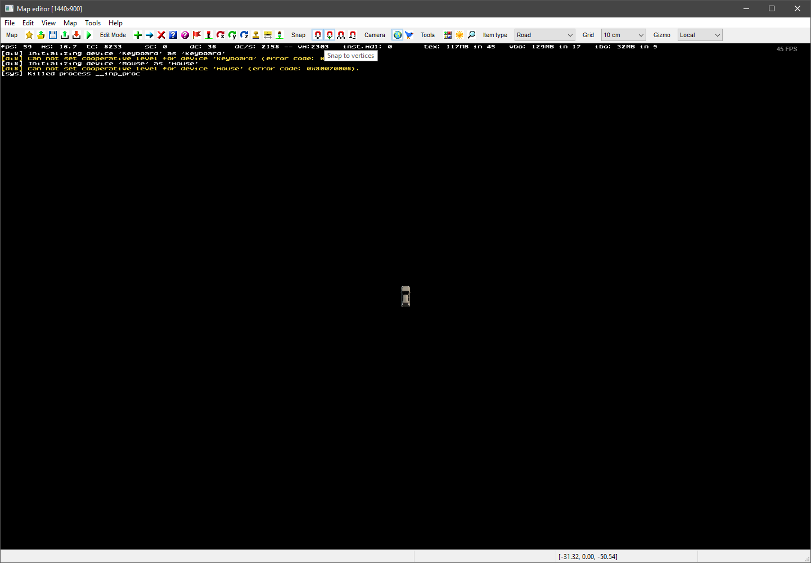
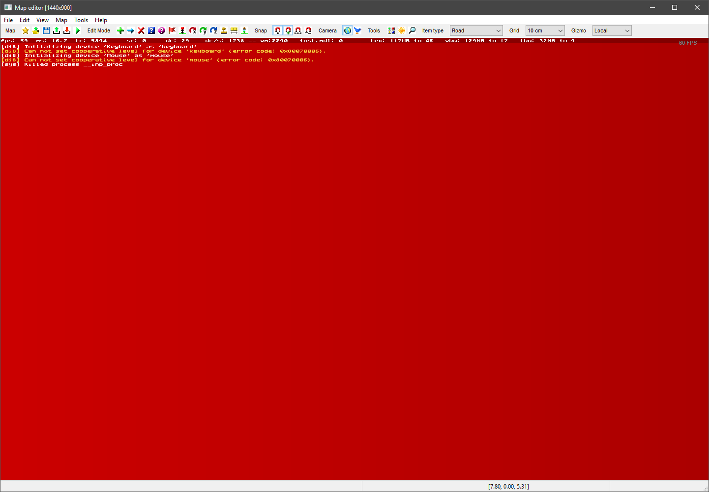

# Tutorial 2 --- Creating your first Worldspace

This tutorial will teach you how to use the editor to create a simple worldspace.

## 1. Open the Editor

Once you've followed the instructions in [Tutorial 1](1_setup.md), you can now launch your game. Once you've passed the opening logos and reached the 'launchpad' screen, you can open your terminal, using the _tilde_ key. (¬, found under the Esc key)

The developer console should appear. To open the editor, type ```edit``` and press enter. After a few seconds the editor window should appear, with a car model on the screen. Press _tilde_ again to close the developer console.



### Troubleshooting

<details>
<summary>My editor screen is nothing but red!</summary>
<p>press the A key until the car reappears on a black background.</p>

</details>

## 2. Drawing a road


