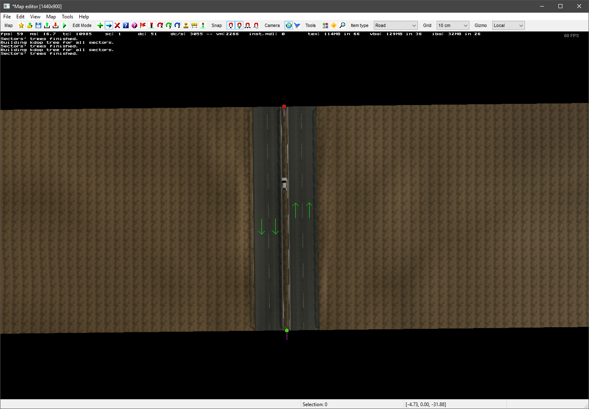

# Tutorial 2 --- Creating your first Worldspace

This tutorial will teach you how to use the editor to create a simple worldspace. This tutorial currently uses ETS2 road types and prefabs. Please contribute to the guide with an ATS version.

## 1. Open the Editor

Once you've followed the instructions in [Tutorial 1](1_setup.md), you can now launch your game. Once you've passed the opening logos and reached the 'launchpad' screen, you can open your terminal, using the _tilde_ key. (¬, found under the Esc key)

The developer console should appear. To open the editor, type ```edit``` and press enter. After a few seconds the editor window should appear, with a car model on the screen. Press _tilde_ again to close the developer console.


### Troubleshooting

Click the arrows to view solutions to the following common issues.

<details>
<summary>My editor screen is nothing but red!</summary>
<p>Press the A key until the car reappears on a black background.</p>

</details>

## 2. Drawing a road

Look on the top bar of the editor. Ensure the 'Item type' is set to road, then press the _New Item_ button. A new window will appear.


This dialog allows us to choose a road to place in the editor. Press the magnifying glass _content browser_ button to the right of 'Road Type'.


You guessed it, another window. This is the content browser, where we can inspect all of the assets in the game. For now, concentrate on the central pane, which will currently show thumbnails for all the road types in the game.

Find a road type named _'City 2 lanes 1m offset'_, this is the 4-lane road type that is found in the city areas throughout Euro Truck Simulator 2. Double click on the thumbnail for this road type, the road type in the _new item_ window should now be updated.


Once you've selected the road type, go back to the main editor window. Click above the car model to create a start node, then once more below the car, a small section of road should appear. Press Esc to finish placing road.



## 3. Road Properties

Return to the top bar of the editor and select the _Properties_ button. Then, double-click the red road node that we placed.


A new and slightly frightening window will appear. This window lists all of the properties for the road segment we just selected. Despite the huge number of boxes on this window, it is straightforward to understand with a little familiarisation.


The dialog is split into options for the left and right terrain of the road, as well as the central reservation. Later we'll also look at the main road properties found at the top-left and top-right of the window.

The road currently looks a little barren. Have a play around with the various properties highlighted above and see what each one does. Then, copy the properties listed below to get a typical setting.


