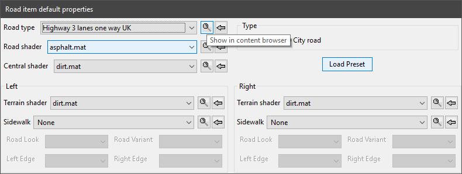
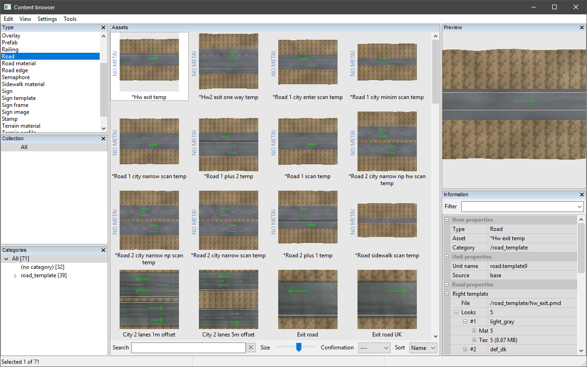
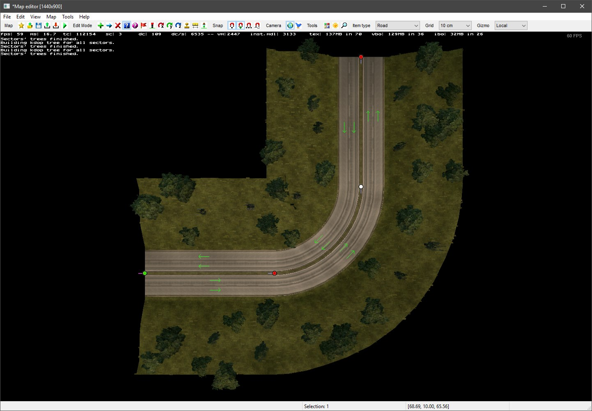

# Tutorial 2 --- Creating your first Worldspace

This tutorial will teach you how to use the editor to create a simple worldspace. This tutorial currently uses ETS2 road types and prefabs. Please contribute to the guide with an ATS version.

1. [Open the editor](#section1)
2. [Draw a road](#section2)
3. [Change the road properties](#section3)
4. [Extending the road](#section4)
5. [Road adjustment basics](#section5)
6.

## 1. Open the Editor <a name="section1"></a>

Once you've followed the instructions in [Tutorial 1](1_setup.md), you can now launch your game. Once you've passed the opening logos and reached the 'launchpad' screen, you can open your terminal, using the _tilde_ key. (¬, found under the Esc key)

The developer console should appear. To open the editor, type ```edit``` and press enter. After a few seconds the editor window should appear, with a car model on the screen. Press _tilde_ again to close the developer console.


### Troubleshooting

Click the arrows to view solutions to the following common issues.

<details>
<summary>My editor screen is nothing but red!</summary>
<p>Press the A key until the car reappears on a black background.</p>

</details>

## 2. Draw a road <a name="section2"></a>

Look on the top bar of the editor. Ensure the 'Item type' is set to road, then press the _New Item_ button. A new window will appear.


This dialog allows us to choose a road to place in the editor. Press the magnifying glass _content browser_ button to the right of 'Road Type'.



You guessed it, another window. This is the content browser, where we can inspect all of the assets in the game. For now, concentrate on the central pane, which will currently show thumbnails for all the road types in the game.

Find a road type named ```City 2 lanes 1m offset```, this is the 4-lane road type that is found in the city areas throughout Euro Truck Simulator 2. Double click on the thumbnail for this road type, the road type in the _new item_ window should now be updated.



Once you've selected the road type, go back to the main editor window. Click above the car model to create a start node, then once more below the car, a small section of road should appear. Press Esc to finish placing road.


## 3. Change the road properties <a name="section3"></a>

Return to the top bar of the editor and select the _Item Properties_ button. Then, double-click the red road node that we placed.


A new and slightly frightening window will appear. This window lists all of the properties for the road segment we just selected. Despite the huge number of boxes on this window, it is straightforward to understand with a little familiarisation.


The dialog is split into options for the left and right terrain of the road, as well as the central reservation. Later we'll also look at the main road properties found at the top-left and top-right of the window.

The road currently looks a little barren. Have a play around with the various properties highlighted above and see what each one does. Then, copy the properties listed below to get a typical setting.


We'll also add crash barriers to this road. Move to the railings tabs and add ```center_crash_barrier_1m.pmd``` and 1 ```outer_crash_barrier_cityroad.pmd```. These models are symmetrical, so they can be placed in either the left or right side.


Once you've finished setting the properties for the road, **press _Set as default_**, so that this road is used for all new placement, then press _OK_ to save the changes to this road.

Back in the editor window, press the C key to switch to the flying camera. Your road should look something like the following image.


## 4. Extending the Road <a name="section4"></a>

This road will lead away from what will become a small city block. We'll extend this road to turn to the west, becoming the end point of this map.

Return to the add item mode, ensuring the item type is still road. Click on the (bottom) green road node, then place two additional nodes, as shown. Press Esc again to finish placing segments.


## 5. Road adjustment basics <a name="section5"></a>

### Moving the road

There are two editor modes for moving placed objects and nodes. The _Move Item_ mode will allow you to click and drag placed node, whereas the _Node Properties_ mode will allow us to set specific positions and change the bend angles.

 

Switch to the Node Properties mode and double-click the first (top-most) node. Set this first nodes position to ```0, 10, 0``` as shown below, then click OK.


There are 3 remaining nodes (including the _forward_ green node). Set the following positions for those nodes.

```
   0,  10,   60
 -40,  10,  100
-100,  10,  100
```

### Making neater turns

By default, the angle between nodes is chosen automatically. This produces smooth curves in many situations, but tends to produce odd results on precise turns such as this right angle.

Open the second node again in Node Properties mode. we can set angles manually, by first **ticking the _Free rotation_ checkbox**, then entering our own rotation in the yaw pitch and roll boxes. Round the yaw values to the nearest 90 degrees. In this case the second and third node should use the following angles.

```
180  0  0
 90  0  0
```

Your turn should now be a lot neater. You should open the second node in _Item_ Properties mode and tick the checkbox named _High-poly road_, the result on the corner piece should be quite noticeable.



## 6. Prefabs

At the top of this current road, we'll begin creating our city block. City roads are a different type of road, so we'll use transition piece to connect the two. Interchanges, roundabouts and transition pieces are all _prefab_ type objects in the SCS software engine.

Open the content browser (shortcut F2) and change the _type_ in the top-left box to prefab. Then, search for the ```road sidewalk end``` prefab. Ensure you've found the correct one, and not a ```4m``` or ```uk``` variant. Double-click on the thumbnail to begin placing the prefab.

Place the prefab above the top road node. Ensure the direction is correct, with the sidewalk at the top of the prefab, then grab the bottom (green) node of the prefab in Move Item mode, and drag it to the red node of the road. It should snap into place.

You can add grass sides to this prefab now if you wish. As with the road, open the prefab in Item Properties mode to do this. Your prefab should now look like this.


## 7. City roads

City roads are similar to regular roads, except they have sidewalks on which pedestrians may appear. To create a city road, change the item type at the top of the editor back to _road_, then press the New Item button again.

The same road type should still be selected. Change the Type radio button to _City road_, then place another road above the prefab.


### Road direction

You may have noticed that roads have an inherent direction, even though they are usually 2-way roads. The road you placed has two nodes. A red _rear_ node, and a greed _forward_ node.

The connections we can create

| Node 1 | Node 2 | Valid?|
| --- | --- | --- |
| Red | Green | Yes |
| Red | Red | No, never connects |
| Green | Green | Yes, when necessary |
