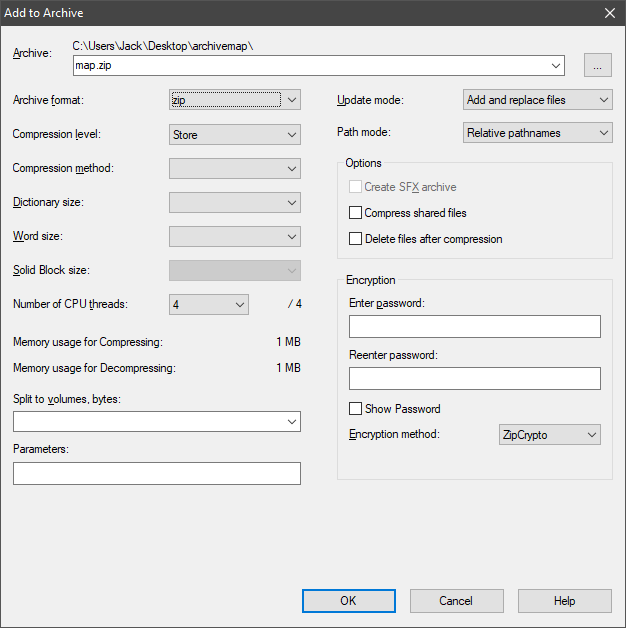

# Tutorial 3 --- Loading and testing your map

This tutorial briefly covers the process of packing your maps to be tested or loaded, then briefly explains why this process is a little more convoluted than one might expect.

1. [Setting up archive files](#section1)
2. [Mod description files](#section2)
3. [Creating the .scs Archive](#section3)
4. [Loading the map](#section4)

<a name="section1"></a>
## 1. Setting up archive files

Creating an .scs Archive

Once you've saved your map in the editor, we will need to gather some of the created loose files and place them in a specific type of ZIP archive.

Firstly, **create** a folder on your desktop called ```archivemap``` or something similar. This folder will be used to ensure the archive structure matches that of the games executable _base_ folder. As such, you now need to **create** the same ```map``` folder as you did in tutorial 1 here.

Find the loose map files in your executable folder --- ```C:\Program Files (x86)\Steam\steamapps\common\Euro Truck Simulator 2``` by default --- under the ```base\map``` folder that you set up in tutorial 1.

Your map folder will currently look something like this

```
autosave
TestMap
TestMap.bak
TestMap.mbd
TestMap.set
```
**copy** _TestMap.mbd_ and the _TestMap_ folder to the map folder on your desktop. Your desktop folder should now look like:

```
archivemap
  map
    TestMap
    TestMap.mbd
```

<a name="section2"></a>
## 2. Mod description files (optional)

It's a good idea to set up the mod description files now, as they can be reused each time you update your archive. The mod description appears in the in-game mod manager, and consists of three files:

- ```manifest.sii``` the main manifest file.
- ```description.txt``` (optional) a text description of the mod, linked to from the manifest file.
- ```mod_icon.jpg``` (optional) a thumbnail image for the mod, linked to from the manifest file.

### manifest.sii

The manifest file is the main file for the mod description. it is simply a text file with a custom file extension. A simple manifest file for your mod would be:

```INI
SiiNunit
{
# ".package_name" does not matter as the dot at the beginning of the file means that this unit is anonymous.
# Please keep this form to not make any conflicts with other mod packages (name collisions).
mod_package : .package_name
{
        # Package version can be any string with any length.
        package_version: "0.1"

        # Display name can be any string with any length.
        display_name: "The test map"

        # Author can be any string with any length.
        author: "scsmoddingguide.github.io"

        # Categories is an array of strings.
        category[]: "map"

        # Icon inside the root directory of the mod.
        # icon: "mod_icon.jpg"

        # Description file inside the root directory of the mod.
        description_file: "description.txt"
}
}
```

Note that the icon setting has been commented out with a # in this case, in case you do not wish to create one. More information on creating manifest files can be found on the [SCS modding wiki](http://modding.scssoft.com/wiki/Documentation/Engine/Mod_manager#Using_the_manifest).

### description.txt
A standard text file containing the mod description. Extra [formatting tags](http://modding.scssoft.com/wiki/Documentation/Engine/Mod_manager#Description_of_your_mod) can be added.

### mod_icon.jpg
The mod icon must be a JPEG image with the exact size of 276px by 162px.

<a name="section3"></a>
## 3. Creating the .scs Archive


Ensure you have returned to the archivemap folder, then **Create** a zip archive of the map folder. To do this with 7-Zip, do ```Right click --> 7-Zip > Add to archive...```. Ensure the _Archive format_ is set to ```zip```, and the _Compression level_ to ```Store```, (no compression) and change the filename to ```TestMap.scs```.



Once you have produced the .scs archive, you need to **move** it to your user folder -- by default located at ```C:\Users\<username>\Documents\Euro Truck Simulator 2```. Inside this folder, there should be a folder named ```mod```, so create one if it isn't there already. place the .scs archive inside the mod folder.

<a name="section4"></a>
## 4. Loading the map

Launch the game again. You do _not_ need to enable the mod in the launchpad mod manager, the editor will read _everything_ in the mod folder. **Open** the editor, this time placing the map name in the command too, i.e. ```edit TestMap```. Ensure the capitalisation is the same as the editor filename. Your map should now load back into the editor, and you can press the _Run Map_ button to test the map.

**hint:** On the writer's machine, the loading screen does not appear immediately. ALT+TAB out and back in and the game should load nearly instantly.


## 5. When do I need to archive?

Unlike most programs, the SCS game engine editor can't load what you've just saved. This is because the editor can only load the files currently loaded by the game, that being the game's base files, as well as any loaded mods.

This means that **each time** you wish to load a map to continue work on it, you must update the archive with the latest version of the map found in the executable base/map folder. The same applies for testing the maps, even if you have a modified version of the map current open in your editor, it will revert to the archive version when you run the map to test.

[<- Tutorial 2 - Creating a basic map](2_firstmap.md)
